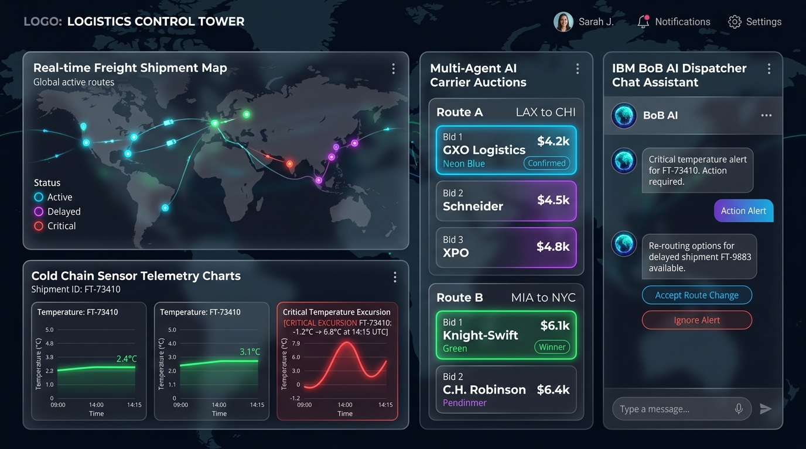

# RouteGuard AI

**Supply Chain Disruption Response, Cold Chain Excursion Detection & Fleet Utilisation Control Tower**

Built for the **IBM BoB AI Innovation Hackathon 2026**  -  Problem Statement: **Supply Chain Disruption Assistant & Fleet Utilisation Optimizer**.



---

## Team Details

- **Team Name:** Vibhishana assembles
- **Required Repository Name:** `bob-ai-hackathon-Vibhishana-assembles`
- **Track:** AI Track
- **Institution:** CHARUSAT

| Role | Name | Email |
|---|---|---|
| **Team Lead** | Brijesh Rakhasiya | `23aiml060@charusat.edu.in` |
| **Member 2** | Vaibhav Tandel | `23dit073@charusat.edu.in` |
| **Member 3** | Maulya Soni | `23dit072@charusat.edu.in` |
| **Member 4** | Om Choksi | `23aiml010@charusat.edu.in` |

---

## Problem Statement Summary

Supply chain disruptions  -  weather events, port strikes, highway blockades  -  cascade across hundreds of active shipments in ways impossible to track manually. Fleet assets (trucks, containers, vessels) sit idle while other routes face overload. Cold chain shipments (vaccines, pharmaceuticals) are especially vulnerable: a single temperature excursion across any leg can spoil a $500K+ cargo, but breaches are typically only discovered at delivery when it is too late.

See [`docs/problem-statement.md`](docs/problem-statement.md) for the complete breakdown.

---

## Solution Architecture & Four Core Pillars

RouteGuard AI combines a deterministic math engine with an autonomous multi-agent negotiation system and an IBM BoB / Watsonx grounded copilot:

1. **Live Disruption Radar & Impact Correlation**: Integrates live public GDACS disaster/weather alerts and NHAI highway advisories, correlating them with active shipment coordinates via Haversine geometry.
2. **Cold Chain IoT Sensor Log Inspector**: Real-time sensor stream monitor that detects temperature excursions pre-delivery and classifies regulatory severity against **WHO Vaccine Protocols** and **USFDA 21 CFR Part 11**.
3. **CrewAI Multi-Agent Carrier Auction**: Autonomous carrier agents (Speed, Cost, and Reliability personas) bid on reroute corridors; a negotiator agent selects the optimal contract.
4. **Fleet Utilisation & Idle Asset Optimizer**: Auto-matches unassigned trucks sitting near disruption nodes to overload freight corridors.
5. **IBM BoB Grounded AI Copilot**: Translates deterministic calculations into instant dispatcher briefs with a strict zero-hallucination policy.

See [`docs/solution-overview.md`](docs/solution-overview.md) and [`docs/architecture.md`](docs/architecture.md) for full design rationale.

---

## Key Features

- **Live Public Disruption Tracking** (GDACS API integration)
- **Deterministic 0-100 Risk Engine** (Fully auditable point breakdown per factor)
- **Cold Chain Sensor Telemetry & Breach Severity Engine** (Pre-delivery alert system)
- **CrewAI Multi-Agent Negotiation Hub** (Live auction visualization)
- **Fleet Asset Redeployment Matrix** (Geo-proximity asset matching)
- **IBM BoB / Watsonx Grounded Copilot** (Grounded natural-language dispatcher briefs)
- **Interactive Pitch Presentation Deck** ([`presentation/presentation_deck.html`](presentation/presentation_deck.html))

---

## Tech Stack

- **Backend:** Python 3.13, FastAPI, Pydantic, PyTest
- **Multi-Agent Orchestration:** CrewAI (Speed, Cost, and Reliability carrier personas)
- **LLM / Copilot:** IBM watsonx.ai (Granite) via OpenAI-compatible endpoint, built with IBM BoB
- **Live Disruption Data:** GDACS Public Disaster & Weather API
- **Frontend Control Tower:** HTML5, Modern CSS3 (Glassmorphism & HSL design system), Vanilla JavaScript (Single-Page Control Tower UI)

---

## Step-by-Step GitHub Setup & Submission Guide

Follow these exact steps to deploy and submit the repository for the hackathon:

### Step 1: GitHub Repository Creation
1. Log in to GitHub.
2. Click **Use this template** from the official template repository or create a new public repository.
3. Set the repository name to **`bob-ai-hackathon-Vibhishana-assembles`** (exact format required for validation).
4. Set visibility to **Public**.
5. Push this codebase to the main branch.

### Step 2: Validate GitHub Actions
1. Navigate to the **Actions** tab in your GitHub repository.
2. Verify that the **Validate Submission** workflow executes successfully and shows a green status.

### Step 3: Local Execution Guide
```bash
# 1. Enter Backend Directory
cd src/backend

# 2. Copy Environment Template & Install Dependencies
cp .env.example .env
pip install -r requirements.txt

# 3. Launch FastAPI Server
uvicorn app.main:app --reload --port 8000
```
- Access Control Tower Dashboard: `http://localhost:8000/app` (or open [`src/frontend/index.html`](src/frontend/index.html) in any browser).
- Interactive Pitch Deck: Open [`presentation/presentation_deck.html`](presentation/presentation_deck.html).
- API Docs: `http://localhost:8000/docs`

### Step 4: Submit Entry
Submit the repository URL (`https://github.com/[your-username]/bob-ai-hackathon-Vibhishana-assembles`) at the official portal: [https://ibm.biz/bob-ai-charusat](https://ibm.biz/bob-ai-charusat) before 11:45 PM IST.

---

## Demo & Presentation

- **Demo Video Link:** [`demo/demo-video-link.txt`](demo/demo-video-link.txt)
- **Live Demo URL:** [`demo/live-demo-url.txt`](demo/live-demo-url.txt)
- **Screenshots:** [`demo/screenshots/`](demo/screenshots/)
- **Pitch Presentation Deck:** [`presentation/RouteGuard_AI_Hackathon_Presentation.md`](presentation/RouteGuard_AI_Hackathon_Presentation.md) & [`presentation/presentation_deck.html`](presentation/presentation_deck.html)

---

## What We Are Most Proud Of

The core risk engine, cold chain excursion detector, and reroute optimizer are **100% deterministic and auditable**  -  every point and regulatory alert can be traced to a named, inspectable factor. The IBM BoB / LLM layer sits strictly on top as an explainer and advisor, grounded to cite only numbers computed by the engine. This hybrid architecture makes AI logistics software reliable, trustworthy, and actionable for real-world dispatchers.
