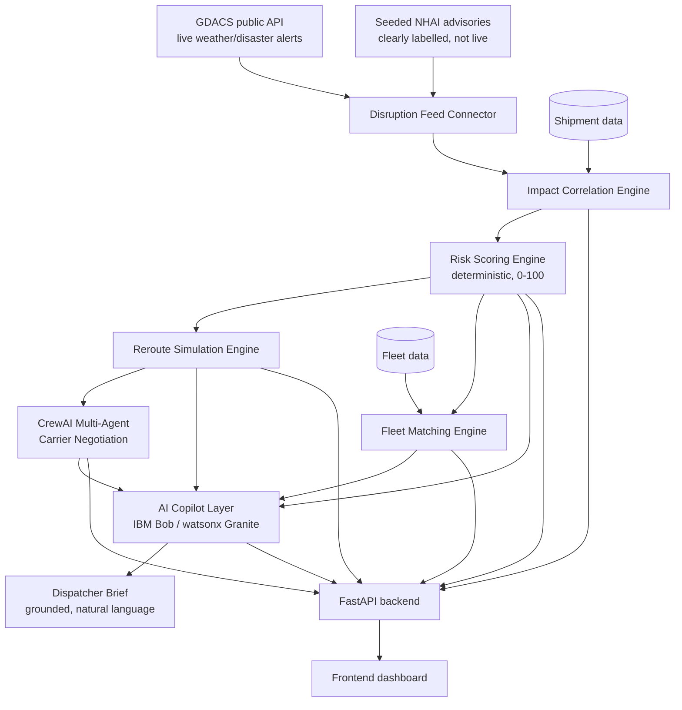

# Architecture

## System diagram

## Component table

| Component | Technology | Responsibility |
|---|---|---|
| Disruption Feed Connector | Python, `httpx`, GDACS public API | Fetches live weather/disaster alerts + seeded highway advisories |
| Impact Correlation Engine | Python (`risk_engine.py`) | Haversine-distance geometry to find which shipments intersect which disruptions |
| Risk Scoring Engine | Python (`risk_engine.py`) | Deterministic 0–100 score from named, weighted factors |
| Reroute Simulation Engine | Python (`reroute_engine.py`) | Generates ranked alternative corridors with time/cost deltas |
| Fleet Matching Engine | Python (`fleet_engine.py`) | Finds and ranks idle fleet assets near a disruption/destination |
| Carrier Negotiation | CrewAI (`carrier_negotiation.py`) | Three carrier agents bid, one negotiator agent selects the best bid |
| AI Copilot | FastAPI route + LLM call (IBM watsonx.ai / Granite, via IBM Bob-assisted development) | Turns computed facts into a grounded natural-language brief |
| Backend API | FastAPI | Exposes all of the above as REST endpoints (`/api/...`, see `/docs`) |
| Frontend | (see `src/frontend/`) | Dispatcher-facing dashboard |

## Data flow, end to end

1. `GET /api/risk/disruptions` triggers `fetch_all_disruptions()`, which calls the live GDACS API and combines it with seeded NHAI data.
2. `GET /api/risk/assessments` correlates every shipment against active disruptions (`find_affected_shipments`) and scores each one (`assess_risk`).
3. `GET /api/risk/reroute/{shipment_id}` runs `simulate_reroutes()` for an at-risk shipment, returning ranked alternative corridors.
4. `POST /api/negotiation/{shipment_id}` runs the CrewAI crew: three carrier agents propose bids grounded in the reroute option's numbers, then a negotiator agent picks the best one for the dispatcher's stated priority.
5. `GET /api/fleet/redeploy/{shipment_id}` finds idle fleet assets near the shipment's destination.
6. `POST /api/copilot/brief` assembles all of the above into one JSON payload and sends it to the LLM with a system prompt that forbids inventing any number not already in the payload — the response is the dispatcher-facing plain-language brief.

## Why NHAI data is seeded, not live

NHAI (National Highways Authority of India) does not publish a public, no-auth, real-time API for highway closures at the time of building this project. Rather than fabricate an "official-looking" live feed, we use a small set of clearly-labelled seeded advisories (`seeded_nhai_disruptions()` in `app/engines/disruption_feed.py`) and document this limitation openly here and in the README. GDACS, by contrast, genuinely is a live public feed and is called directly with no seeding.

## Security & scalability notes

- No real credentials are committed; `.env` is git-ignored and `.env.example` lists every required variable.
- The current implementation uses in-memory demo data (`app/models/demo_data.py`) rather than a database — documented as a known limitation, straightforward to swap for Postgres/similar for anything beyond the hackathon demo.
- CORS is wide open (`allow_origins=["*"]`) for demo convenience only — this must be restricted before any real deployment.
